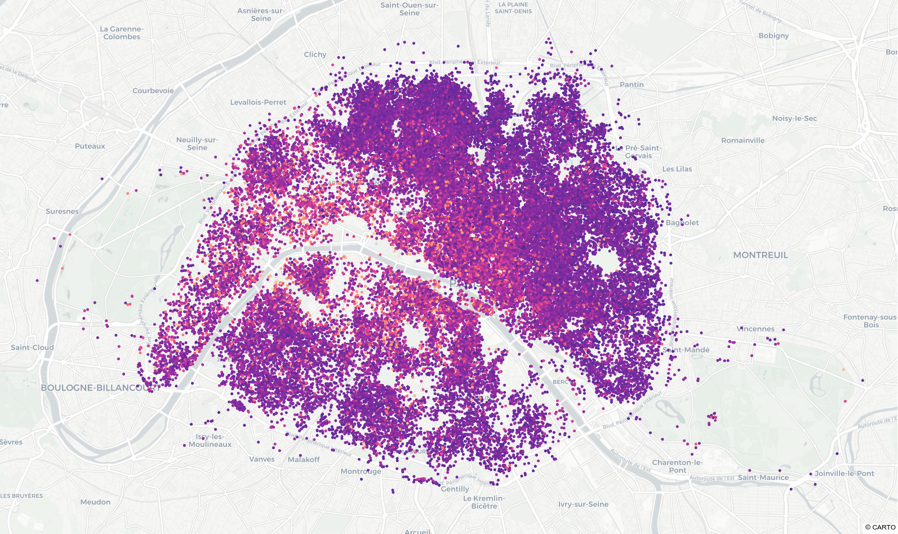

# Airbnb price analysis with Spark

<iframe width='1200' height='800' src='/assets/html/paris_prices_scatter.html' frameborder='0'></iframe>

The notebook of this folder presents how to use [Spark](https://spark.apache.org/) to clean, explore and model prices on the Paris Airbnb dataset.

The notebook has been redacted in french but you can find the corresponding english article in my portfolio here : https://antonindurieux.github.io/portfolio/3_Airbnb_prices_prediction/, under a beautiful presentation and with some interactive visualizations. 

This project was an open choice work with Spark presented during my Post Master's Degree in Big Data at Télécom-Paris.

## Usage

The whole code and explanation is in the [Projet_SD701_antonin_durieux.ipynb](https://github.com/antonindurieux/Airbnb-price-analysis-with-Spark/blob/master/Projet_SD701_antonin_durieux.ipynb) notebook.

## Data

The data has been downloaded from http://insideairbnb.com/, "an independent, non-commercial set of tools and data that allows you to explore how Airbnb is really being used in cities around the world”.

## Content

The notebook shows :
- How to get from he raw data to a Spark DataFrame
- How to clean and explore the dataset with Spark
- How to preprocess the data
- How to use a machine-learning algorithm for price modeling